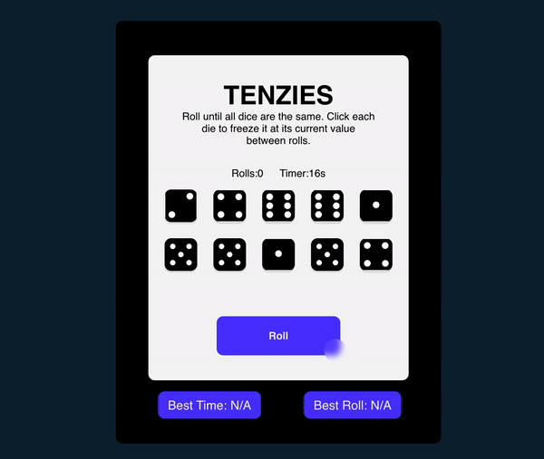

# Tenzies Game

Create a Tenzies Game using React.JS framework and its functionalities
### :camera: Screenshot

## :hammer: Technologies & Tool

- React.JS
- LocalStorage
- Semantic HTML5 markup
- CSS custom properties
- Flexbox

### :bulb: Getting Started with Create React App

This project was bootstrapped with [Create React App](https://github.com/facebook/create-react-app).

### :computer: Useful resources

- [ReactJS](https://reactjs.org/tutorial/tutorial.html) - How to set up a local development environment on your computer
- [MDN](https://developer.mozilla.org/en-US/docs/Web/API/Window/localStorage) - Window.localStorage
- [Scrimba](https://scrimba.com/learn/learnjavascript/your-first-localstorage-coaa54cbd950661b84f5857b7) - How to use localStorage
- [SimplerNerd](https://simplernerd.com/js-get-substring-before-char/) - How to Get the Substring Before a Character in JavaScript
- [Confetti @Github](https://github.com/alampros/react-confetti)
- [Nanoid @Github](https://github.com/ai/nanoid#react)
- <a href="https://www.flaticon.com/free-icons/luck" title="luck icons">Luck icons created by Freepik - Flaticon</a>
- <a href="https://www.flaticon.com/free-icons/dice" title="dice icons">Dice icons created by IconsNova - Flaticon</a>
- <a href="https://www.flaticon.com/free-icons/dice" title="dice icons">Dice icons created by Google - Flaticon</a>

## :bust_in_silhouette: Author

- Website - [Farai Major](https://faraimajor.com/)

